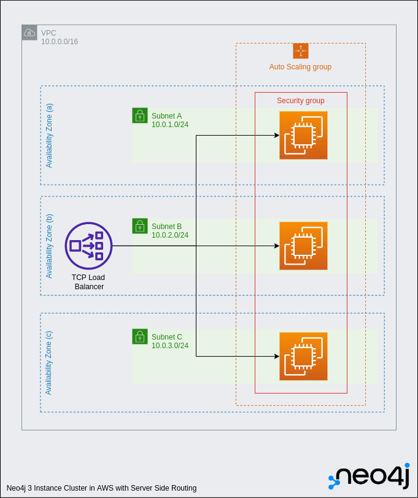

# amazon-cloud-formation-neo4j
This repository holds the Amazon CloudFormation Template (CFT) that deploys Neo4j Enterprise on the Amazon Web Services (AWS) platform (optionally including Neo4j Graph Data Science and Neo4j Bloom)   

This codebase is also used (without modification) Neo4j to deploy the official Neo4j offering into the AWS Marketplace. 

Therefore, the easiest method to deploy Neo4j on AWS Elastic Compute Cloud (EC2) instances, is to go directly to the [AWS Marketplace]https://aws.amazon.com/marketplace/pp/prodview-akmzjikgawgn4)

# Provisioned Resources
The following resources are created by the CFT, and users will need to ensure they have the correct permissions within AWS to provision them:

Users are reminded that cloud resources incur costs.

## Single Instance
- 1 VPC, with a CIDR Range of 10.0.0.0/16
- 3 Subnets, distributed evenly across 3 Availability zones, with the following CIDR Ranges:
  - 10.0.1.0/24
  - 10.0.2.0/24
  - 10.0.3.0/24
- 1 or 3 EC2 instances (Depending on whether a single instance, or a 3 instance cluster is selected )
- 1 Network (Layer 4) Load Balancer

## Three node cluster
- 1 VPC, with a CIDR Range of 10.0.0.0/16
- 3 Subnets, distributed evenly across 3 Availability zones, with the following CIDR Ranges:
  - 10.0.1.0/24
  - 10.0.2.0/24
  - 10.0.3.0/24
- 3 EC2 instances (Depending on whether a single instance, or a 3 instance cluster is selected )
- 1 Network (Layer 4) Load Balancer

## Common Considerations
- All users are reminded that the provisioning of cloud resources will incur costs
- Users will need to ensure that they have the correct permissions with AWS to deploy the CFT and create the associated cloud resources
- Autoscaling groups are included as part of this topology which means that EC2 instances will be re-created if deleted.  This should be considered default and expected behaviour
- To delete all resources, users should delete the CloudFormation template, rather than attempting to delete individual resources within AWS.

# Updating the AMI (For Neo4j Employees)
To updating the AWS Marketplace listing, a new AMI ID is required.  This should be obtained via the AWS account associated with Neo4j's publisher.  

If you're setting up a publisher account for the first time, you'll need to add a role as decribed [here](https://docs.aws.amazon.com/marketplace/latest/userguide/ami-single-ami-products.html#single-ami-marketplace-ami-access).

Packer and a python script are used to generate AMIs. The AWS marketplace will ensure that AMIs are copied across regions. 

The ID of the new AMI should be added into the product load form before a new submission is made.  In addition, login to [Marketplace Portal](https://aws.amazon.com/marketplace/management/manage-products/?#/share) and add the AMI.

## Updating the Marketplace Listing
CFT deploys in AWS Marketplace aren't self service.  At some point that might change.  So, next up is updating the product load form.  That's stored [here](https://docs.google.com/spreadsheets/d/1Nmpw3etZX7xj6nQgS5w3K2B-i0gJevdQ/edit?usp=sharing&ouid=115505246243451814800&rtpof=true&sd=true).  Note that AWS will almost certainly continue to rev the product load form.  So, you might periodically be forced to grab a new copy from to publisher portal.

You'll defintely want to update the version ID in the product load form.  You will need to update the AMI ID as well, if you built a new one.

Once the product load form is all up to date, you'll just need to resubmit it in the portal [here](https://aws.amazon.com/marketplace/management/offers).

There is currently no API for any of this, so the process has to be manual.  If we didn't have a CFT we could automate.
