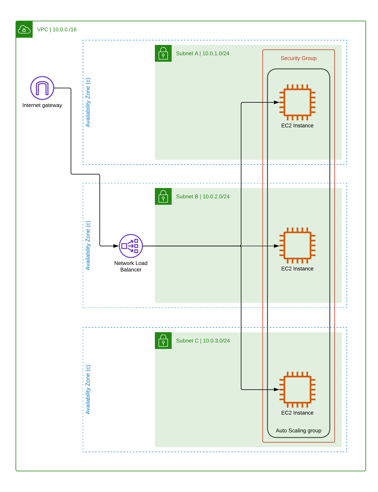

# amazon-cloud-formation-neo4j
This repository holds the Amazon CloudFormation Template (CFT) that deploys Neo4j Enterprise (version 4.4 or 5) on the Amazon Web Services (AWS) platform (optionally including Neo4j Graph Data Science and Neo4j Bloom)  

These CloudFormation Templates are also used to Neo4j to deploy the official Neo4j offering into the AWS Marketplace. 

Therefore, the easiest method to deploy Neo4j on AWS Elastic Compute Cloud (EC2) instances, is to go directly to the [AWS Marketplace]https://aws.amazon.com/marketplace/pp/prodview-akmzjikgawgn4

# Provisioned Resources
The following resources are created by the CFT, and users will need to ensure they have the correct permissions within AWS to provision them:

Users are reminded that cloud resources incur costs.

## Single Instance
- 1 VPC, with a CIDR Range of 10.0.0.0/16
- 3 Subnets, distributed evenly across 3 Availability zones, with the following CIDR Ranges:
  - 10.0.1.0/24
  - 10.0.2.0/24
  - 10.0.3.0/24
- 1 or 3 EC2 instances (Depending on whether a single instance, or a 3 instance cluster is selected )
- 1 Network (Layer 4) Load Balancer

## Three node cluster
- 1 VPC, with a CIDR Range of 10.0.0.0/16
- 3 Subnets, distributed evenly across 3 Availability zones, with the following CIDR Ranges:
  - 10.0.1.0/24
  - 10.0.2.0/24
  - 10.0.3.0/24
- 3 EC2 instances (Depending on whether a single instance, or a 3 instance cluster is selected )
- 1 Network (Layer 4) Load Balancer

## Common Considerations
- Users are reminded that the provisioning of cloud resources will incur costs
- Users will need to ensure that they have the correct permissions with AWS to deploy the CFT and create the associated cloud resources
- Autoscaling groups are included as part of this topology which means that EC2 instances will be re-created if deleted.  This should be considered default and expected behaviour
- To delete all resources, users should delete the CloudFormation template, rather than attempting to delete individual resources within AWS.

