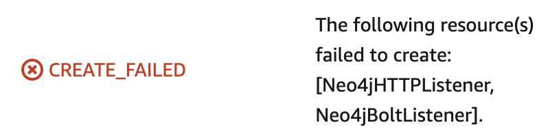

# Neo4j behind an Application Load Balancer (ALB) with SSL/TLS

## Description

This custom CloudFormation Template (CFT) provides a method of deploying Neo4j with a secure (SSL/TLS) connection between the client and the Network Load Balancer.  All traffic after (or 'south') of the ALB will remain unencrypted, as will traffic between the Neo4j EC2 instances.

## Cloud Topology
AWS Resources will be deployed as per the following diagram (this example depicts a 3 node Neo4j cluster):


## Prerequisites
There are two vital prerequisites which must be met prior to deploying this template:

1) You have administrative access to an internet Domain and are able to create DNS entries against (hereafter known as "SSLDomain")

2) You have created (or are able to create) a TLS Certificate in AWS Certificate Manager, pointing to SSLDomain

If you attempt to run this CloudFormation Template without observing the pre-requisite steps, the CloudFormation template will fail and you will experience the following error:



## Installation Instructions
_These steps assume that the prerequisites listed above are met.  In this example, the domain edrandall.uk will be used._

### Stage 1 - SSL Certificate and DNS Configuration
1) Request a public TLS certificate from Amazon Certificate Manager


2) Enter your SSLDomain and leave the "DNS Validation" box selected.


3) Your new certificate will be created and show as "pending validation"


4) Click the Certificate ID and take note of the CNAME which will need to be created in your own DNS to 'prove' to AWS that you own and control this domain.

5) In your own provider's console, create the CNAME.


6) After a few minutes (could take longer depending on DNS propogation speeds) your new certificate should change status to "Issued"


### Stage 2 - CloudFormation Template Installation
1) Deploy the CloudFormation template in the usual way, either by uploading the CFT to the CloudFormation section of the AWS console, or by running the deploy.sh script:

```
./deploy.sh nlb-with-ssl
{
    "StackId": "arn:aws:cloudformation:us-east-1:540622579701:stack/nlb-with-ssl/535f3180-5c50-11ed-a315-1260d77cfdf9"
}
```
Note the following additional values which are required to configure SSL and are therefore not included in the standard Neo4j [AWS Markplace Template](../../marketplace/).  You will need to provide these values, either in the ./deploy.sh script or in the CloudFormation GUI. 


2) Once the CloudFormation template has deployed, you will need to review the outputs and take note of the values shown.


3) Create a another CNAME to point from your desired SSLDomain to the FQDN of the Application Load Balancer


4) Once the DNS records have propogated, your neo4j deployment can be accessed using your SSL domain (https://SSLDOMAIN:7474/browser/)


Note:  It is necessary to enter the complete URL as referenced above (including the trailing '/')


