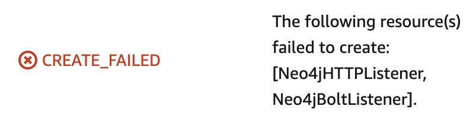

# AWS Markpletace CloudFormation Template for Neo4j Enterprise (Private EC2 Instances)

## Description

This custom CloudFormation Template (CFT) provides a method of deploying Neo4j with a secure (SSL/TLS) connection between the client and the Network Load Balancer (NLB).   The EC2 instances are deployed in PRIVATE subnets behind an INTERNET FACING Network Load Balancer.  This means that the EC2 instances are not provisioned with Public IP addresses and are therefore not directly routable over the internet.  However, the Neo4j cluster will be made available as a result of the NLB and the additional PUBLIC subnets which are created.

Because the SSL/TLS connection is terminated at the NLB, all traffic after the NLB (inside the AWS environment) will remain unencrypted, including traffic between the Neo4j EC2 instances.

For the domain specified, the CloudFormation Template will create the certificate within the AWS Certificate Manager and register the DNS within Route 53.

NOTE:  This CFT can take up to 10 minutes to deploy. It won't show as "CREATE COMPLETE" in the AWS CloudFormation console until all AWS resources have been deployed AND the Neo4j Cluster is up, running and available.

## Cloud Topology
AWS Resources will be deployed as per the following diagram (this example depicts a 3 node Neo4j cluster):


## Prerequisites
There are two vital prerequisites which must be met prior to deploying this template:

1) You have administrative access to an internet Domain and are able to create DNS entries against (hereafter known as "SSLDomain")

2) You have the ability to create a TLS Certificate in AWS Certificate Manager, pointing to SSLDomain

If you attempt to run this CloudFormation Template without observing the pre-requisite steps, the CloudFormation template will fail and you will experience the following error:



## Installation Instructions

_These steps assume that the prerequisites listed above are met.  In this example, the domain jshair.neo4j-field.com will be used._

### CloudFormation Template Installation
A) Deploy the CloudFormation template in the usual way, either by uploading the CFT to the CloudFormation section of the AWS console, or by running the deploy.sh script.  Remember to take a look inside the deploy.sh script and understand the variables that need to be set before executing it:

```
#!/bin/bash

STACK_NAME=$1
TEMPLATE_BODY="file://neo4j-nlb-priv-ssl.template.yaml"

REGION=$(aws configure get region)

# User configurable variables
NumberOfServers=3
BastionSSHCIDR="0.0.0.0/0"
InstallGraphDataScience="No"
InstallBloom="No"
REGION="us-west-1"
Password="foobar123%"
graphDataScienceLicenseKey="None"
bloomLicenseKey="None"
SSHKeyName="jhair-neo4j-us-east-2"

# Update with your Route 53 Hosted Zone Id
R53HostedZoneId="XXXXXXXXXXXXXXXXXXXX"
# Update with your SSL Name to create the SSL certificates and DNS entry within Route 53
SSLDomain="jshair.neo4j-field.com"

aws cloudformation create-stack \
--capabilities CAPABILITY_IAM \
--stack-name $STACK_NAME \
--template-body $TEMPLATE_BODY \
--region $REGION \
--disable-rollback \
--parameters \
ParameterKey=Password,ParameterValue=${Password} \
ParameterKey=NumberOfServers,ParameterValue=${NumberOfServers} \
ParameterKey=BastionSSHCIDR,ParameterValue=${BastionSSHCIDR} \
ParameterKey=InstallGraphDataScience,ParameterValue=${InstallGraphDataScience} \
ParameterKey=GraphDataScienceLicenseKey,ParameterValue=${graphDataScienceLicenseKey} \
ParameterKey=InstallBloom,ParameterValue=${InstallBloom} \
ParameterKey=BloomLicenseKey,ParameterValue=${bloomLicenseKey} \
ParameterKey=R53HostedZoneId,ParameterValue=${R53HostedZoneId} \
ParameterKey=SSHKeyName,ParameterValue=${SSHKeyName} \
ParameterKey=SSLDomain,ParameterValue=${SSLDomain}
```

Note: The deploy.sh script takes a single command-line argument, which is the desired name of the Cloudformation Stack:
```
./deploy.sh my-neo4j-cft
{
    "StackId": "arn:aws:cloudformation:us-east-1:540622579701:stack/nlb-with-ssl/535f3180-5c50-11ed-a315-1260d77cfdf9"
}
```
Note the following additional values which are required to configure SSL and are therefore not included in the standard Neo4j [AWS Markplace Template](../../marketplace/).


# Provisioned Resources
The following resources are created by the CFT, and users will need to ensure they have the correct permissions within AWS to provision them:

_Users are reminded that the deployment of cloud resources will incur costs._

- 1 VPC, with a CIDR Range of 10.0.0.0/16
- 6 Subnets, distributed evenly across 3 Availability zones, with the following CIDR Ranges:
  - [Public Subnet 1]  10.0.1.0/24
  - [Public Subnet 2]  10.0.2.0/24
  - [Public Subnet 3]  10.0.3.0/24
  - [Private Subnet 1] 10.0.4.0/24
  - [Private Subnet 2] 10.0.5.0/24
  - [Private Subnet 3] 10.0.6.0/24
- 1, or between 3 and 10 EC2 instances (Depending on whether a single instance, or an autonomous cluster is selected)
- 1 Network (Layer 4) Load Balancer
- 1 NAT Gateway

## Navigate to the Neo4j Browser via a web browser

Once the DNS records have propogated, your neo4j deployment can be accessed using your SSL domain. Note that you will need to enter the complete URL including the directory suffix:  https://SSLDOMAIN/browser/


## Common Considerations
- The simplest way to deploy Neo4j on an IaaS environment is to use the [Neo4j Listing in the AWS Marketplace](https://aws.amazon.com/marketplace/pp/prodview-akmzjikgawgn4)
- Users are reminded that the provisioning of cloud resources will incur costs
- Users will need to ensure that they have the correct permissions with AWS to deploy the CFT and create the associated cloud resources
- Autoscaling groups are included as part of this topology which means that EC2 instances will be re-created if deleted.  This should be considered default and expected behaviour.
- To delete all resources, users should delete the CloudFormation template, rather than attempting to delete individual resources within AWS.