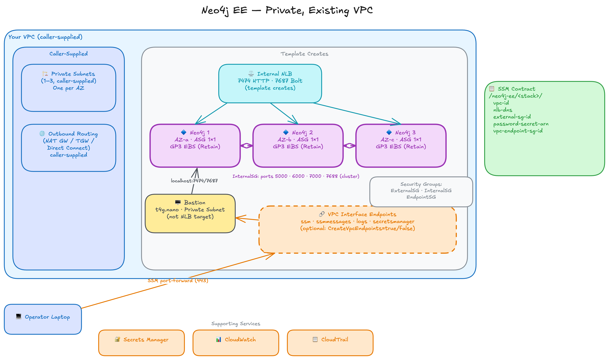

# Neo4j EE: Private, Existing VPC

`neo4j-private-existing-vpc.template.yaml` deploys a Neo4j Enterprise cluster into a VPC you supply.

- **What it deploys:** bastion, internal NLB, cluster ASGs, EBS volumes, security groups, SSM contract
- **What it does not deploy:** VPC, subnets, internet gateway, NAT Gateways — outbound routing is the caller's responsibility
- **You provide:** `VpcId` and `PrivateSubnet1Id/2Id/3Id` (one subnet per AZ for a 3-node cluster)
- **When to use:** the cluster must live inside an existing network — peered VPC, Transit Gateway, shared services account, or a VPC managed by a separate infrastructure team

> **Marketplace operator** (deployed from AWS Marketplace, running stack):
> Start with [Prerequisites](#prerequisites) and the [Operator Guide](#operator-guide) below.
>
> **Template developer** (working on the templates, deploying from source):
> Start with [Local Deployment and Testing](#local-deployment-and-testing).
> The [Operator Guide](#operator-guide) applies once your stack is running.

## Contents

- [Operator Guide](#operator-guide)
  - [Prerequisites](#prerequisites)
  - [Access, Admin Tools, and Password](#access-admin-tools-and-password)
  - [Observability Checks](#observability-checks)
- [Architecture](#architecture)
  - [AWS Resources Created](#aws-resources-created)
  - [Relationship to the Private Template](#relationship-to-the-private-template)
  - [VPC Interface Endpoint Design](#vpc-interface-endpoint-design)
  - [What the Caller's VPC Must Provide](#what-the-callers-vpc-must-provide)
  - [Platform Contract](#platform-contract)
- [Local Deployment and Testing](#local-deployment-and-testing)
  - [Build](#build)
  - [Deploy](#deploy)
  - [Create a Test VPC](#create-a-test-vpc)
  - [Path A: Template Creates Endpoints (CI Gate)](#path-a-template-creates-endpoints-ci-gate)
  - [Path B: Pre-Existing Endpoints](#path-b-pre-existing-endpoints)
  - [Tear Down](#tear-down)

---

## Operator Guide

Applies to any running ExistingVpc stack, whether deployed from the Marketplace or from source.

### Prerequisites

**AWS tooling, Python tooling, and IAM permissions** are the same as the Private template. See [Prerequisites in PRIVATE.md](PRIVATE.md#prerequisites).

**VPC requirements:**
- Private subnets with outbound internet routing (NAT Gateway, Transit Gateway, or equivalent)
- One subnet for a single-instance deployment; three subnets in different AZs for a three-node cluster
- No pre-existing VPC interface endpoints for `ssm`, `ssmmessages`, `logs`, or `secretsmanager` when `CreateVpcEndpoints=true` (creating duplicates fails the deployment)

**`AllowedCIDR`** defaults to `10.0.0.0/16`. Pass `--allowed-cidr` explicitly if your VPC uses a different CIDR.

### Access, Admin Tools, and Password

Bastion access and all operator tools (`uv run preflight`, `validate-private`, `admin-shell`, `run-cypher`, `uv run scripts/smoke-write.py`, `uv run scripts/browser-tunnel.py`, `uv run scripts/bolt-tunnel.py`) are identical to the Private template. See [the Operator Guide in PRIVATE.md](PRIVATE.md#operator-guide) from "Access via Bastion" onward.

### Observability Checks

```bash
./test-observability.sh                  # most recent deployment
./test-observability.sh <stack-name>     # specific deployment
```

Same five steps as the Private template: CloudWatch agent, log streams, VPC flow logs, failed-auth alarm, and CloudTrail.

---

## Architecture



### AWS Resources Created

The template creates the following inside your VPC. It does **not** create: VPC, subnets, internet gateway, or NAT Gateways. Outbound internet routing is the responsibility of the VPC you supply.

| AWS Resource | What it creates |
|---|---|
| Internal NLB | Listeners on port 7474 (HTTP Browser) and 7687 (Bolt); deployed into the subnets you supply |
| EC2 instances | 1 or 3 Neo4j nodes in your private subnets; no public IPs |
| ASG per node | One Auto Scaling Group per Neo4j node, fixed at `MinSize=MaxSize=DesiredCapacity=1`, for self-healing |
| EBS data volumes | One GP3 volume per node with `DeletionPolicy: Retain`; survives stack deletion |
| Operator bastion | `t4g.nano` in your private subnet, not registered as an NLB target; receives SSM sessions for operator access |
| VPC interface endpoints | `ssm`, `ssmmessages`, `logs`, `secretsmanager` with `PrivateDnsEnabled: true`; created when `CreateVpcEndpoints=true` (the default), skipped when `CreateVpcEndpoints=false` |
| Security groups | NLB SG (AllowedCIDR on 7474/7687 to the NLB); External SG (NLB SG as source on 7474/7687 to instances); Internal SG (cluster ports 5000/6000/7000/7688 between members only); Endpoint SG (gating access to the VPC endpoints) |
| SSM parameters | `/neo4j-ee/<stack>/` prefix; publishes VPC ID, NLB DNS, security group IDs, and secret ARN |
| Secrets Manager | Neo4j admin password at `neo4j/<stack>/password` |
| CloudWatch | Log group, VPC flow logs, failed-auth alarm, CloudTrail trail |

### Relationship to the Private Template

Structurally identical to `neo4j-private.template.yaml`: same operator bastion, same internal NLB, same cluster ASGs, same SSM platform contract. The only difference is that this template does not provision any VPC or networking infrastructure — it accepts `VpcId` and `PrivateSubnet1Id/2Id/3Id` and deploys into the caller-supplied network.

- **NLB hairpin fix** (non-target bastion + `preserve_client_ip.enabled=false`) — applies identically. See [Operator Bastion: NLB Hairpin in PRIVATE.md](PRIVATE.md#operator-bastion-nlb-hairpin)
- **Password security model** (alphanumeric-only `AllowedPattern`, Secrets Manager retrieval at boot, no UserData embedding) — identical. See [Password Security Model in PRIVATE.md](PRIVATE.md#password-security-model)

### VPC Interface Endpoint Design

**`CreateVpcEndpoints` parameter** (default `true`)

- **`true` — Path A:** template creates endpoints for `ssm`, `ssmmessages`, `logs`, and `secretsmanager` plus a dedicated endpoint security group
- **`false` — Path B:** caller supplies an existing endpoint SG via `ExistingEndpointSgId`. A CloudFormation `Rules` block enforces this — deployment fails at parameter validation if missing
- **Why one flag, not per-service:** enterprise VPCs that have endpoints virtually always have a single shared SG covering all five. Per-service flags produce half-managed states that the single `vpc-endpoint-sg-id` SSM contract parameter cannot represent

**Endpoint security group ingress**

- Both paths publish `vpc-endpoint-sg-id` to SSM, pointing at the functional endpoint SG (template-created in Path A, caller-supplied in Path B)
- Applications follow the same contract in both cases: add their SG to this SG's ingress on port 443
- Instance and bastion SGs are wired into the endpoint SG at deploy time. In Path B, the template adds `AWS::EC2::SecurityGroupIngress` rules into the pre-existing SG and removes them on stack deletion

### What the Caller's VPC Must Provide

| Requirement | Notes |
|---|---|
| Private subnets with outbound routing | NAT Gateway, Transit Gateway, or Direct Connect; the template provisions none of these |
| One subnet per AZ for a 3-node cluster | Each Neo4j node and its bastion are placed in the subnet passed via `PrivateSubnet1/2/3Id` |
| No duplicate interface endpoints | If `CreateVpcEndpoints=true`, the VPC must not already have `ssm`, `ssmmessages`, `logs`, or `secretsmanager` endpoints; use `CreateVpcEndpoints=false` if it does |
| Matching CIDR in `AllowedCIDR` | Defaults to `10.0.0.0/16`; pass `--allowed-cidr` if your VPC uses a different range |

### Platform Contract

Identical to the Private template. See [Platform Contract in PRIVATE.md](PRIVATE.md#platform-contract) for the full SSM parameter reference.

## Local Deployment and Testing

### Build

Regenerate the output template after editing any file in `templates/src/`:

```bash
cd neo4j-ee/templates
python build.py
```

Commit both the edited partial and the regenerated `neo4j-private-existing-vpc.template.yaml`.

### Deploy

Pass the VPC and subnet IDs at deploy time:

```bash
cd neo4j-ee

# 1-node memory-optimized instance in us-east-2
./deploy.py --mode ExistingVpc \
  --number-of-servers 1 \
  --region us-east-2 \
  --vpc-id vpc-0123456789abcdef0 \
  --subnet-1 subnet-0123456789abcdef0 \
  r8i.xlarge

# 3-node (three subnets required, one per AZ)
./deploy.py --mode ExistingVpc \
  --vpc-id vpc-0123456789abcdef0 \
  --subnet-1 subnet-11111111111111111 \
  --subnet-2 subnet-22222222222222222 \
  --subnet-3 subnet-33333333333333333

# With Marketplace AMI
./deploy.py --marketplace --mode ExistingVpc \
  --vpc-id vpc-0123456789abcdef0 \
  --subnet-1 subnet-0123456789abcdef0

# VPC already has interface endpoints; skip endpoint creation
./deploy.py --mode ExistingVpc \
  --vpc-id vpc-0123456789abcdef0 --subnet-1 subnet-0123456789abcdef0 \
  --create-vpc-endpoints false \
  --existing-endpoint-sg-id sg-0123456789abcdef0
```

The deploy script writes outputs to `.deploy/<stack-name>.txt`. Stack creation takes 10-20 minutes (includes AMI copy if the region differs from the source AMI region; pin `--region` to the source region to skip the copy).

For a deeper local check after template edits, run:

```bash
python3 templates/build.py --verify
python3 -m py_compile deploy.py
```

`cfn-lint templates/neo4j-private-existing-vpc.template.yaml` is also useful, but the current template emits known `W1030` warnings for optional blank ExistingVpc parameters. Treat any other warnings or errors as failures.

### Create a Test VPC

For automated testing, `scripts/create-test-vpc.py` provisions a minimal private-networking VPC (`10.42.0.0/16`) and writes all resource IDs to `.deploy/vpc-<ts>.txt`. `deploy.py` reads that file automatically when `--mode ExistingVpc` and no `--vpc-id` is provided:

```bash
# Path A: template creates endpoints (default)
scripts/create-test-vpc.py --region us-east-1
./deploy.py --mode ExistingVpc --number-of-servers 3

# Path B: VPC already has endpoints
scripts/create-test-vpc.py --region us-east-1 --with-endpoints
./deploy.py --mode ExistingVpc --number-of-servers 1 \
  --create-vpc-endpoints false

# Select a specific VPC file when multiple exist
./deploy.py --mode ExistingVpc --vpc-file .deploy/vpc-<ts>.txt
```

Tear down the test VPC after the stack is deleted:

```bash
scripts/teardown-test-vpc.py       # deletes test VPC, NAT gateways, subnets, endpoints, removes vpc-*.txt
```

`teardown-test-vpc.py` defaults to the most recently modified `vpc-*.txt` in `.deploy/`. Pass a VPC deployment name (`vpc-<ts>`) to target a specific one.

> **Note:** The template does not create NAT Gateways. The test VPC created by `create-test-vpc.py` does provision NAT Gateways; tear it down promptly after testing.

### Path A: Template Creates Endpoints (CI Gate)

```bash
cd neo4j-ee

# 1. Create test VPC (no endpoints)
scripts/create-test-vpc.py --region us-east-1

# 2. Deploy 3-node cluster (auto-detects vpc-*.txt)
./deploy.py --mode ExistingVpc --number-of-servers 3
STACK=$(ls -t .deploy/ee-*.txt | head -1 | xargs basename | sed 's/\.txt$//')

# 3. Preflight (11 checks: stack, bastion, endpoints)
cd validate-private
uv run preflight "$STACK"

# 4. Basic cluster validation (8 checks)
uv run validate-private --stack "$STACK"

# 5. Failover suite
uv run validate-private --stack "$STACK" --suite failover

# 6. Resilience suite
uv run validate-private --stack "$STACK" --suite resilience

# 7. Tear down — see Tear Down below
```

### Path B: Pre-Existing Endpoints

```bash
cd neo4j-ee

# 1. Create test VPC with endpoints
scripts/create-test-vpc.py --region us-east-1 --with-endpoints

# 2. Deploy 1-node cluster (auto-detects VPC file and reads EndpointSgId)
./deploy.py --mode ExistingVpc --number-of-servers 1 \
  --create-vpc-endpoints false
STACK=$(ls -t .deploy/ee-*.txt | head -1 | xargs basename | sed 's/\.txt$//')

# 3. Preflight: endpoint reachability confirms the wiring the template added
cd validate-private
uv run preflight "$STACK"

# 4. Basic cluster validation (cluster roles: 1 writer for 1-node is PASS)
uv run validate-private --stack "$STACK"

# 5. Tear down — see Tear Down below
```

### Tear Down

Always tear down the stack before the test VPC. The stack adds `AWS::EC2::SecurityGroupIngress` rules to VPC resources; if those rules remain when the VPC is deleted, the deletion stalls.

```bash
# 1. Delete the stack (removes SecurityGroupIngress rules automatically)
cd neo4j-ee
./teardown.sh --delete-volumes <stack-name>

# 2. Delete the test VPC and its NAT Gateways, subnets, and endpoints
scripts/teardown-test-vpc.py
```

`teardown-test-vpc.py` defaults to the most recently modified `vpc-*.txt` in `.deploy/`. Pass a VPC deployment name (`vpc-<ts>`) to target a specific one.
