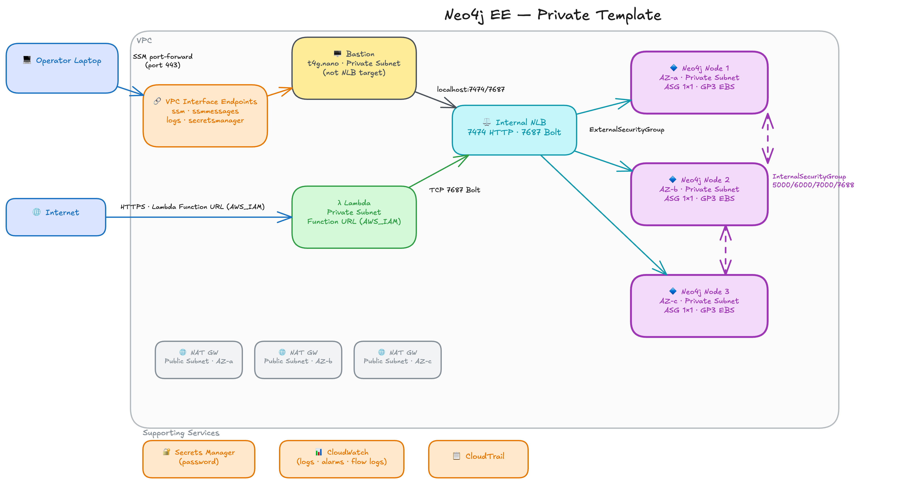

# Neo4j EE: Private

`neo4j-private.template.yaml` deploys a Neo4j Enterprise cluster in private subnets behind an internal Network Load Balancer. No instance has a public IP. Operator access runs through a dedicated `t4g.nano` bastion using AWS Systems Manager Session Manager. Use this topology for production, staging, and regulated workloads.

## Contents

- [General Operator Guide](#general-operator-guide)
  - [Prerequisites](#prerequisites)
  - [Preflight Check](#preflight-check)
  - [Access via Bastion](#access-via-bastion)
  - [Bolt Tunnel](#bolt-tunnel)
  - [Browser Tunnel](#browser-tunnel)
  - [Retrieve the Password](#retrieve-the-password)
  - [Admin Shell](#admin-shell)
  - [Ad-Hoc Cypher Queries](#ad-hoc-cypher-queries)
  - [Observability](#observability)
- [Architecture](#architecture)
  - [Network Topology](#network-topology)
  - [AWS Resources Created](#aws-resources-created)
  - [NLB Routing](#nlb-routing)
  - [Operator Bastion: NLB Hairpin](#operator-bastion-nlb-hairpin)
  - [Platform Contract](#platform-contract)
  - [Password Security Model](#password-security-model)
  - [TLS Architecture](#tls-architecture)
- [Local Deployment and Testing](#local-deployment-and-testing)
  - [Build](#build)
  - [Deploy](#deploy)
  - [Preflight and Basic Validation](#preflight-and-basic-validation)
  - [Smoke Test](#smoke-test)
  - [Failover Suite](#failover-suite)
  - [Resilience Suite](#resilience-suite)
  - [Tear Down](#tear-down)
  - [Troubleshooting](#troubleshooting)

---

## General Operator Guide

All `uv run` commands (`admin-shell`, `run-cypher`, `validate-private`) must be run from `neo4j-ee/validate-private/`. Shell scripts under `scripts/` must be run from `neo4j-ee/validate-private/` as well.

### Prerequisites

**AWS tooling**

```bash
aws --version                                    # AWS CLI v2
brew install --cask session-manager-plugin       # required for SSM port-forward tunnels
session-manager-plugin --version
```

**Python tooling**

```bash
python3 --version   # 3.11+
brew install uv     # package manager for validate-private and test suite
```

**IAM permissions**

These are the minimum permissions the operator's local IAM principal (user or assumed role) needs to run the tools in this guide. Each permission corresponds to API calls made from the operator's machine. The cluster nodes use a separate IAM role scoped to what they need at boot.

| Permission | Resource | Used by |
|---|---|---|
| `cloudformation:DescribeStacks`, `cloudformation:DescribeStackResources` | The stack ARN | `preflight.sh`, `deploy.py` (reads stack outputs) |
| `ssm:SendCommand`, `ssm:GetCommandInvocation`, `ssm:StartSession`, `ssm:DescribeInstanceInformation` | The bastion instance | `browser-tunnel.sh`, `bolt-tunnel.sh`, `admin-shell`, `run-cypher`, `validate-private`, `preflight.sh` (bastion ping check) |
| `ssm:GetParameter`, `ssm:GetParametersByPath` | `/neo4j-ee/<stack-name>/*` | Any tool that resolves the NLB DNS or security group IDs from the platform contract |
| `secretsmanager:GetSecretValue`, `secretsmanager:DescribeSecret` | `neo4j/<stack-name>/password` | `get-password.sh`, `preflight.sh` (secret existence check) |

### Preflight Check

Before running any other tool, confirm the stack and bastion are ready:

```bash
cd neo4j-ee/validate-private
./scripts/preflight.sh                     # most recent deployment
./scripts/preflight.sh <stack-name>        # specific deployment
```

Expected output on a healthy stack:

```
=== Preflight Checks ===

  Stack:   test-ee-1776575131
  Region:  us-east-1
  Bastion: i-0abc123def456789

  [PASS] Stack status = CREATE_COMPLETE
  [PASS] Bastion SSM PingStatus = Online
  [PASS] neo4j Python driver installed on bastion
  [PASS] cypher-shell installed on bastion
  [PASS] Secret 'neo4j/test-ee-1776575131/password' exists
  [PASS] Contract SSM params: vpc-id, nlb-dns, advertised-dns, external-sg-id, password-secret-arn, vpc-endpoint-sg-id
  [INFO] Operational SSM params: region, stack-name, private-subnet-1-id, private-subnet-2-id
  [PASS] VPC interface endpoints: secretsmanager, logs, ssm, ssmmessages
  [PASS] Endpoint reachable: secretsmanager.us-east-1.amazonaws.com
  [PASS] Endpoint reachable: logs.us-east-1.amazonaws.com
  [PASS] Endpoint reachable: ssm.us-east-1.amazonaws.com
  [PASS] Endpoint reachable: ssmmessages.us-east-1.amazonaws.com

  11 passed, 0 failed
```

If the bastion SSM check fails immediately after a fresh deploy, the bastion UserData may still be running. Wait 2-3 minutes and retry.

### Access via Bastion

Instances have no public IP. All operator access goes through the `t4g.nano` bastion via SSM Session Manager.

| Tool | How it connects | Tunnel needed? |
|---|---|---|
| `uv run admin-shell` | SSM interactive session on the bastion | No |
| `uv run run-cypher` | SSM `RunShellScript` on the bastion | No |
| `uv run validate-private` | SSM `RunShellScript` on the bastion | No |
| `./scripts/smoke-write.sh` | SSM `RunShellScript` on the bastion | No |
| Local driver or client tool | Bolt connection from your laptop | Yes — Bolt tunnel (7687) |
| Neo4j Browser | HTTPS for the web UI + Bolt for queries | Yes — both tunnels (7473 + 7687) |

Run `uv run` commands from `neo4j-ee/validate-private/`.

Local port-forwarding is only needed when your laptop connects to the NLB directly. All CLI tools dispatch commands to the bastion over SSM and receive results back without a tunnel.

### Bolt Tunnel

Use the Bolt tunnel when you want to connect a local driver, client tool, or script to the cluster from your laptop:

```bash
./scripts/bolt-tunnel.sh      # localhost:7687 → NLB:7687  (blocks; Ctrl-C to close)
```

Connect with `neo4j+s://<AdvertisedDNS>:7687` after mapping `AdvertisedDNS` to `127.0.0.1` in `/etc/hosts`. The hosts mapping is required because the NLB presents an ACM cert whose SAN matches `AdvertisedDNS`; connecting to `localhost` directly fails TLS validation.

Use `bolt+s://` rather than `neo4j+s://` if you want to bypass the routing table — `neo4j+s://` will receive a routing table containing `AdvertisedDNS` itself, which (after the hosts mapping) resolves back to `localhost` and works through the same tunnel.

The Bolt tunnel is also required alongside the Browser Tunnel when using Neo4j Browser — see [Browser Tunnel](#browser-tunnel).

### Browser Tunnel

Use this to open the Neo4j Browser web UI. The browser makes two connections: HTTPS to load the UI (port 7473) and Bolt to run queries (port 7687). Both tunnels must be open simultaneously.

**Single-command option** — run from `neo4j-ee/`:

```bash
./browse.sh                   # most recent deployment
./browse.sh <stack-name>      # specific deployment
```

`browse.sh` reads `.deploy/<stack-name>.txt`, opens both SSM port-forward tunnels in the same shell (7473 and 7687), and prints the URL and credentials. Press Ctrl+C to close both tunnels.

**Two-terminal option** — run from `neo4j-ee/validate-private/`:

```bash
./scripts/browser-tunnel.sh   # localhost:7473 → NLB:7473  (blocks; Ctrl-C to close)
./scripts/bolt-tunnel.sh      # localhost:7687 → NLB:7687  (blocks; Ctrl-C to close)
```

Add `127.0.0.1 <AdvertisedDNS>` to `/etc/hosts`, then open `https://<AdvertisedDNS>:7473`. When prompted for a connection URL, enter `neo4j+s://<AdvertisedDNS>:7687`. For the password, see [Retrieve the Password](#retrieve-the-password).

> **Note:** Connection strings inside Neo4j Browser show `AdvertisedDNS`, which now resolves to `127.0.0.1` for the duration of the tunnel session. Remove the hosts entry when finished.

> **Note:** Writes through Neo4j Browser go to whichever node the NLB selects, which may not be the leader, producing a `NotALeader` error. Use `uv run admin-shell` for writes.

### Retrieve the Password

```bash
./scripts/get-password.sh

# To capture it:
PASSWORD=$(./scripts/get-password.sh 2>/dev/null)
```

The password is stored in Secrets Manager at `neo4j/<stack-name>/password` as a plain string: the password value itself, not JSON.

Only the Browser Tunnel requires the password locally — you type it into the Neo4j Browser login form. `admin-shell` and `run-cypher` resolve the password on the bastion using the bastion's IAM role; it never appears on your local machine or in CloudTrail.

### Admin Shell

For Cypher queries and write operations:

```bash
cd neo4j-ee/validate-private
uv run admin-shell                     # most recent deployment
uv run admin-shell <stack-name>        # specific deployment
```

Opens `cypher-shell` on the bastion with a `neo4j+s://<AdvertisedDNS>:7687` URI. The Neo4j driver fetches the routing table and directs writes to the current leader automatically. The password is resolved on the bastion using the bastion's IAM role. It does not appear on the local machine or in CloudTrail.

```
neo4j@neo4j> CREATE (n:Test {msg: "hello"}) RETURN n;
neo4j@neo4j> MATCH (n:Test) DELETE n;
neo4j@neo4j> :exit
```

### Ad-Hoc Cypher Queries

```bash
cd neo4j-ee/validate-private
uv run run-cypher "CALL dbms.components() YIELD name, versions, edition RETURN name, versions[0] AS version, edition"

# Output is JSON; pipe to jq for formatting
uv run run-cypher "SHOW SERVERS YIELD name, address, state, health" | jq .

# Target a specific stack
uv run run-cypher <stack-name> "MATCH (n) RETURN count(n) AS total"
```

### Observability

```bash
cd neo4j-ee
./test-observability.sh                  # most recent deployment
./test-observability.sh <stack-name>     # specific deployment
```

| Step | What it checks | Typical duration |
|---|---|---|
| `cloudwatch` | CloudWatch agent active on all nodes | <1 min |
| `logs` | Application log group exists with expected stream count | <1 min |
| `flowlogs` | VPC flow log group exists and has ENI streams | <1 min |
| `alarm` | Failed-auth alarm transitions to ALARM after 12 bad login attempts | ~7 min |
| `cloudtrail` | A multi-region CloudTrail trail exists and is logging | <1 min |

---

## Architecture



### Network Topology

**Three-node cluster:**
- VPC with three public subnets (one per AZ) hosting NAT Gateways, and three private subnets (one per AZ) hosting the Neo4j instances
- Internal NLB with TLS listeners on 7473 (HTTPS) and 7687 (Bolt), end-to-end encrypted to instances via TLS target groups, targets spread across all three private subnets
- Three Neo4j EC2 instances in private subnets, forming a Raft cluster
- Three NAT Gateways for outbound traffic from the cluster members
- One `t4g.nano` operator bastion in a private subnet, not registered as an NLB target
- VPC interface endpoints for `ssm`, `ssmmessages`, `logs`, and `secretsmanager` with `PrivateDnsEnabled: true`

**Single instance:**
- VPC with one public subnet (NAT Gateway) and one private subnet (EC2 instance)
- Internal NLB in the private subnet
- One NAT Gateway
- One `t4g.nano` operator bastion

### AWS Resources Created

| AWS Resource | What it creates |
|---|---|
| VPC | New VPC with public subnets (NAT Gateways) and private subnets (Neo4j instances); 3 AZs for a cluster, 1 AZ for a single instance |
| NAT Gateways | One per AZ for outbound internet access from the cluster nodes |
| Internal NLB | Listeners on port 7473 (HTTPS) and 7687 (Bolt); routable from inside the VPC only |
| EC2 instances | 1 or 3 Neo4j nodes in private subnets; no public IPs |
| ASG per node | One Auto Scaling Group per Neo4j node, fixed at `MinSize=MaxSize=DesiredCapacity=1`, for self-healing |
| EBS data volumes | One GP3 volume per node with `DeletionPolicy: Retain`; survives stack deletion |
| Operator bastion | `t4g.nano` in a private subnet, not registered as an NLB target; receives SSM sessions for operator access |
| VPC interface endpoints | `ssm`, `ssmmessages`, `logs`, `secretsmanager` with `PrivateDnsEnabled: true`; no NAT required for AWS service calls |
| Security groups | NLB SG (AllowedCIDR on 7473/7687 to the NLB); External SG (NLB SG as source on 7473/7687 to instances); Internal SG (cluster ports 5000/6000/7000/7688 between members only); Endpoint SG (gating access to the VPC endpoints) |
| SSM parameters | `/neo4j-ee/<stack>/` prefix; publishes VPC ID, NLB DNS, security group IDs, and secret ARN for downstream consumers |
| Secrets Manager | Neo4j admin password at `neo4j/<stack>/password` |
| CloudWatch | Log group, VPC flow logs, failed-auth alarm, CloudTrail trail |

### NLB Routing

At boot, each cluster node sets:

```
server.bolt.advertised_address  = <AdvertisedDNS>:7687
server.https.advertised_address = <AdvertisedDNS>:7473
dbms.routing.default_router     = SERVER
```

Every routing table entry points back to `AdvertisedDNS`. A driver connecting with `neo4j+s://` receives a routing table containing only `AdvertisedDNS`, sends all subsequent requests through it, and lets Neo4j server-side routing handle leader vs. follower direction. The NLB terminates TLS on the listener using the customer-supplied ACM cert (whose SAN matches `AdvertisedDNS`) and re-encrypts to the instance using a self-signed backend cert generated at boot, so the wire is encrypted from client to instance.

| Access pattern | URI | Notes |
|---|---|---|
| Same VPC | `neo4j+s://<AdvertisedDNS>:7687` | Full cluster failover. `AdvertisedDNS` must resolve to the NLB via Route 53 (private hosted zone or public record). |
| Peered VPC / Transit Gateway | `neo4j+s://<AdvertisedDNS>:7687` | Same. The NLB DNS resolves to private IPs reachable through the peering route; the Route 53 record can target the NLB hostname. |
| SSM tunnel | `neo4j+s://<AdvertisedDNS>:7687` (with `127.0.0.1 <AdvertisedDNS>` in `/etc/hosts`) | Routing table returns `AdvertisedDNS` → loops back to the tunnel via the hosts entry. |
| Direct node IP | `neo4j+ssc://<node-ip>:7687` | Bypasses NLB; single node, no failover. `+ssc` skips cert validation since the self-signed backend cert is not bound to an IP. |

**`neo4j+s://` through an SSM tunnel relies on `/etc/hosts`.** The driver opens a TLS handshake to `<AdvertisedDNS>:7687`. The hosts entry resolves that to `127.0.0.1`, so the tunnel terminates the connection at the NLB. The NLB presents the ACM cert; the cert's SAN matches `AdvertisedDNS`, so the driver validates successfully. The server then returns a routing table containing `<AdvertisedDNS>:7687`, and the driver loops back through the same tunnel for subsequent connections. No custom Python resolver is needed.

### Operator Bastion: NLB Hairpin

The bastion is `t4g.nano`, sits in the same private subnet as the cluster, and is not registered as an NLB target. It solves a specific AWS networking failure that surfaces when operator tunnels run through a cluster member.

**The failure.** When SSM tunnels ran through a Neo4j cluster member instead of a dedicated bastion, every third connection timed out. NLB target health was fine; VPC endpoints, security groups, and routing all checked out.

**Root cause.** NLB target groups default to `preserve_client_ip.enabled=true`. With preservation on, each target sees the real source IP of incoming connections. When a cluster node tunnels an SSM session outward, the source IP of each new connection is that node's own private IP. The NLB flow-hashes across the three registered targets. When the hash selects the same node as the origin — a 1-in-3 probability — the instance receives a packet with source IP equal to its own IP. The kernel treats that as invalid and silently drops the reply.

**The fix.** Two layers ship together:

| Layer | Mechanism |
|---|---|
| `preserve_client_ip.enabled=false` on both NLB target groups | Each target sees the NLB ENI IP as the source. A `src == dst` collision is structurally impossible. |
| Dedicated non-target bastion | The bastion's IP is outside the NLB target pool. Hairpin cannot happen by construction. |

Either mitigation alone closes the observed failure. Both ship together so the template stays correct if a future edit changes the target-group attributes or the operator-access pattern.

**Trade-off.** With client IP preservation disabled, `security.log` on the Neo4j instances records the NLB's private ENI IP as the connection source, not the real operator IP. For an internal-only deployment, per-client attribution at the Neo4j layer is already obscured by the NLB, which is an acceptable trade-off. Customers requiring the true peer IP at the application layer can retrieve it via NLB Proxy Protocol v2.

### Platform Contract

The stack publishes resource IDs via SSM under `/neo4j-ee/<stack-name>/` so that applications and operator tooling can wire themselves up without knowing stack internals. `preflight.sh` validates both groups on every run.

**Contract parameters** — required; all six must exist:

| Parameter | Purpose |
|---|---|
| `/neo4j-ee/<stack>/vpc-id` | VPC the application should attach to |
| `/neo4j-ee/<stack>/nlb-dns` | Internal NLB DNS name; map `AdvertisedDNS` to this hostname for TLS clients to validate the ACM cert SAN |
| `/neo4j-ee/<stack>/advertised-dns` | Public DNS that resolves to the NLB and matches the ACM cert SAN; clients connect via `neo4j+s://<advertised-dns>:7687` and `https://<advertised-dns>:7473` |
| `/neo4j-ee/<stack>/external-sg-id` | NLB security group that accepts client/app ingress on 7473 and 7687 |
| `/neo4j-ee/<stack>/password-secret-arn` | Secrets Manager ARN for the Neo4j password |
| `/neo4j-ee/<stack>/vpc-endpoint-sg-id` | Security group attached to the VPC interface endpoints |

**Operational parameters** — informational:

| Parameter | Purpose |
|---|---|
| `/neo4j-ee/<stack>/region` | AWS region |
| `/neo4j-ee/<stack>/stack-name` | Stack name |
| `/neo4j-ee/<stack>/private-subnet-1-id` | First private subnet |
| `/neo4j-ee/<stack>/private-subnet-2-id` | Second private subnet |
| `/neo4j-ee/<stack>/private-route-table-1-id` | Route table for the first private subnet |

**VPC interface endpoints.** All four regional service hostnames (`ssm`, `ssmmessages`, `logs`, `secretsmanager`) resolve to private IPs inside the VPC. No endpoint URL overrides are needed in application code, and no NAT data-processing charges apply to AWS service calls.

The `vpc-endpoint-sg-id` parameter is the mechanism by which applications opt into reaching these endpoints. Each application adds its own security group to the endpoint SG's ingress on port 443. Opening the endpoint SG to the whole VPC CIDR would allow any workload in the VPC to call SSM and Secrets Manager via PrivateLink. The published SG ID approach requires each application to explicitly opt in, creating an auditable per-application record and a clean removal path.

See [`sample-private-app/README.md`](../sample-private-app/README.md) for the full application connection pattern.

### Password Security Model

The `Password` CloudFormation parameter accepts only alphanumerics (`^[a-zA-Z0-9]{24,}$`). This prevents shell metacharacter injection: lookahead-based patterns that admit arbitrary characters allow values like `Test1$(cmd)` to execute as root during boot. `deploy.py` generates a 32-character value by default.

The password is stored in Secrets Manager at `neo4j/<stack-name>/password` and is never written to the EC2 LaunchTemplate UserData. `NoEcho: true` only suppresses the value in CloudFormation API responses. It has no effect on UserData, which any IAM principal with `ec2:DescribeLaunchTemplateVersions` can read. The cluster nodes retrieve the password from Secrets Manager at boot via their IAM role, which has `secretsmanager:GetSecretValue` scoped to that secret.

### TLS Architecture

TLS is mandatory. The NLB terminates TLS on 7473 (HTTPS Browser) and 7687 (Bolt) using the `CertificateArn` ACM certificate, and the target groups re-encrypt to a self-signed backend cert generated on each instance at boot. The wire is encrypted from client to NLB and from NLB to instance.

**Customer responsibilities at deploy time:**

1. Provision an ACM certificate whose Subject Alternative Name matches the DNS name you will pass as `AdvertisedDNS`. ACM-issued public certs and ACM Private CA certs are both accepted.
2. Create a Route 53 record that resolves `AdvertisedDNS` to the NLB. A private hosted zone with an A-record alias to the NLB is the typical pattern; a public Route 53 record works too.
3. Pass `CertificateArn` and `AdvertisedDNS` as CloudFormation parameters at stack create or update.

**Backend cert lifecycle.** Each cluster node generates a self-signed cert in `/var/lib/neo4j/certificates/{bolt,https}/` on first boot using `openssl req -x509`. The NLB does not validate the backend cert (per AWS NLB documentation), so a self-signed cert is sufficient for the re-encryption leg. On instance replacement the cert is regenerated; this has no client-visible effect because clients only ever see the NLB-presented ACM cert.

**ACM cert rotation.** ACM-managed certs renew automatically. To swap to a different cert (different ARN), update the `CertificateArn` parameter on the stack — CloudFormation updates the listener in place, no instance refresh required.

**Residual risk.** Cluster-internal ports (5000, 6000, 7000, 7688) remain plaintext between cluster members, protected by the cluster security group. An actor with `ec2:RunInstances` permission to launch into the cluster subnet with the cluster security group, `ec2:CreateTrafficMirrorSession` targeting a cluster ENI, or root on any cluster node can observe replication traffic on the wire. For regulated workloads or shared-tenancy accounts where IAM blast radius extends beyond the cluster operator team, request cluster TLS before deploying.

---

## Local Deployment and Testing

### Build

Regenerate the output template after editing any file in `templates/src/`:

```bash
cd neo4j-ee/templates
python build.py
```

Commit both the edited partial and the regenerated `neo4j-private.template.yaml`.

### Deploy

`--cert-arn` and `--advertised-dns` are mandatory: TLS is required and the operator must provide both before deployment. Provision an ACM certificate whose SAN matches `AdvertisedDNS`, and create a Route 53 record that resolves `AdvertisedDNS` to the NLB after the stack is created (or update an existing record before the first client connects).

```bash
cd neo4j-ee

# 3-node cluster, t3.medium, pin region to avoid AMI copy
./deploy.py --region us-east-1 \
  --cert-arn arn:aws:acm:us-east-1:111111111111:certificate/abcd-efgh-ijkl-mnop \
  --advertised-dns neo4j.example.com

# Single instance
./deploy.py --number-of-servers 1 --region us-east-1 \
  --cert-arn <arn> --advertised-dns <dns>

# Memory-optimized instance
./deploy.py r8i.xlarge --region us-east-1 \
  --cert-arn <arn> --advertised-dns <dns>

# Use the published Marketplace AMI
./deploy.py --marketplace --cert-arn <arn> --advertised-dns <dns>

# Enable CloudWatch alarm email notifications
./deploy.py --alert-email you@example.com --cert-arn <arn> --advertised-dns <dns>
```

The default mode is Private. No `--mode` flag needed. Stack creation takes 5-10 minutes. The script writes outputs to `.deploy/<stack-name>.txt`.

> **Cost note.** Private mode provisions 3 NAT Gateways for a cluster (~$0.045/hr each) or 1 for a single instance. Tear down promptly after testing.

### Preflight and Basic Validation

```bash
cd neo4j-ee/validate-private

./scripts/preflight.sh <stack-name>            # 11 checks: stack, bastion, endpoints

uv run validate-private                        # most recent deployment
uv run validate-private --stack <stack-name>   # specific deployment
```

`validate-private` runs 8 checks via the bastion: Bolt connectivity, server edition, listen address, memory configuration, data directory, APOC, GDS, and cluster roles (1 writer, expected follower count). Each check takes 3-5 seconds. Total time under 35 seconds.

### Smoke Test

```bash
./scripts/smoke-write.sh                       # 20 CREATE/DELETE iterations
./scripts/smoke-write.sh <stack-name> 50       # custom iteration count
```

Runs write operations through the cluster via the bastion. Each iteration uses a fresh driver connection to exercise routing table handling.

### Failover Suite

```bash
cd neo4j-ee/validate-private
uv run validate-private --stack <stack-name> --suite failover
```

Four cases using `systemctl stop`/`start` via SSM; no instance termination:

| Case | What it does | Typical runtime |
|---|---|---|
| `follower-with-data` | Stop a follower, write data, restart, verify data visible | ~60 s |
| `leader` | Stop the leader, verify election, write on new leader | ~90 s |
| `rolling` | Stop each node in turn; cluster stays available throughout | ~4-15 min |
| `reads` | Stop two followers; verify reads still served by remaining nodes | ~90 s |

### Resilience Suite

```bash
cd neo4j-ee/validate-private
uv run validate-private --stack <stack-name> --suite resilience
```

Two cases that terminate EC2 instances and wait for ASG replacement:

| Case | What it does | Timeout |
|---|---|---|
| `single-loss` | Terminate 1 node; verify EBS reattach, sentinel data intact, quorum reforms | 900 s |
| `total-loss` | Terminate all 3 nodes; verify all 3 volumes reattach, sentinel intact | 1200 s |

Each case writes a sentinel file to the data volume before termination and verifies it survives on the replacement instance, confirming `DeletionPolicy: Retain` and NVMe device resolution both work.

### Tear Down

```bash
./teardown.sh <stack-name>
./teardown.sh --delete-volumes <stack-name>   # also permanently deletes EBS volumes
```

If the sample private app is deployed, tear it down first or stack deletion will stall on its security group ingress rules:

```bash
cd neo4j-ee/sample-private-app && ./teardown-sample-private-app.sh <stack>
cd neo4j-ee && ./teardown.sh --delete-volumes <stack>
```

### Troubleshooting

**"Bastion SSM PingStatus = Online" fails**
The bastion UserData may still be running in the first 3 minutes after stack creation. Retry after waiting. If the check still fails after 10 minutes, confirm the bastion's IAM role has `AmazonSSMManagedInstanceCore` and the VPC has `ssm` and `ssmmessages` interface endpoints.

**"AccessDenied" on `GetSecretValue` or `GetParameter`**
The bastion's IAM role does not have access to the secret or SSM parameter for this stack. The policy scopes to `neo4j/<stack-name>/password` and `/neo4j-ee/<stack-name>/*`. Re-deploying the stack re-creates the policy with the correct scope.

**"NotALeader" error in Neo4j Browser**
The NLB routed a write to a follower. Use `uv run admin-shell` for writes: `neo4j+s://` routing directs writes to the leader automatically.

**Bastion Python checks fail but SSM is Online**
The bastion installs Python 3.11 alongside the AL2023 system Python 3.9, with `neo4j` and `boto3` under 3.11. If package installation failed during UserData, reinstall via SSM:

```bash
aws ssm send-command \
  --instance-ids <bastion-id> \
  --document-name AWS-RunShellScript \
  --parameters "commands=[\"python3.11 -m pip install 'neo4j>=6,<7' boto3\"]" \
  --region <region>
```

Check `cloud-init-output.log` for the root cause first:

```bash
aws ssm send-command \
  --instance-ids <bastion-id> \
  --document-name AWS-RunShellScript \
  --parameters 'commands=["tail -50 /var/log/cloud-init-output.log"]' \
  --region <region>
```

**Mounting an existing EBS snapshot and resetting the password**

When a data volume is restored from a snapshot, the Neo4j system database on that volume already contains the auth store from the original deployment. The password in Secrets Manager will not match, producing `Neo.ClientError.Security.Unauthorized` on every connection.

`neo4j-admin dbms set-initial-password` does not help here. It only takes effect when the system database has never been initialized. On a snapshot restore the system database already exists, so the command is silently ignored.

The correct procedure is to disable authentication temporarily, set the password via Cypher, then re-enable:

```bash
# 1. Remove any existing auth_enabled entries and disable auth
aws ssm send-command --instance-ids <node-id> --document-name AWS-RunShellScript \
  --parameters 'commands=[
    "systemctl stop neo4j",
    "sed -i \"/dbms.security.auth_enabled/d\" /etc/neo4j/neo4j.conf",
    "echo \"dbms.security.auth_enabled=false\" >> /etc/neo4j/neo4j.conf",
    "systemctl start neo4j"
  ]' --region <region>

# 2. Once Neo4j is up, set the password to match Secrets Manager
PASSWORD=$(./scripts/get-password.sh 2>/dev/null)
aws ssm send-command --instance-ids <node-id> --document-name AWS-RunShellScript \
  --parameters "commands=[
    \"for i in \$(seq 1 30); do cypher-shell -a bolt+ssc://localhost:7687 -u neo4j -p \\\"\\\" \\\"RETURN 1\\\" >/dev/null 2>&1 && break || sleep 3; done\",
    \"cypher-shell -a bolt+ssc://localhost:7687 -u neo4j -p \\\"\\\" \\\"ALTER USER neo4j SET PASSWORD '${PASSWORD}' CHANGE NOT REQUIRED\\\"\"
  ]" --region <region>

# 3. Re-enable auth
aws ssm send-command --instance-ids <node-id> --document-name AWS-RunShellScript \
  --parameters 'commands=[
    "systemctl stop neo4j",
    "sed -i \"/dbms.security.auth_enabled/d\" /etc/neo4j/neo4j.conf",
    "echo \"dbms.security.auth_enabled=true\" >> /etc/neo4j/neo4j.conf",
    "systemctl start neo4j"
  ]' --region <region>
```

Get `<node-id>` from the ASG:

```bash
aws autoscaling describe-auto-scaling-groups \
  --auto-scaling-group-names <Neo4jNode1ASGName> \
  --region <region> \
  --query 'AutoScalingGroups[0].Instances[*].InstanceId' \
  --output text
```

The `<Neo4jNode1ASGName>` value is in `.deploy/<stack-name>.txt`. For a three-node cluster, repeat steps 2 and 3 for each node's ASG (`Neo4jNode2ASGName`, `Neo4jNode3ASGName`).

> **Note:** `dbms.security.auth_enabled` may appear multiple times in `neo4j.conf` if the recovery procedure is run more than once. Neo4j 5 treats duplicate keys as a fatal config error and refuses to start. The `sed -i "/dbms.security.auth_enabled/d"` step above removes all occurrences before adding a single clean entry, which prevents this.

Reference: [Recover admin user and password — Neo4j Operations Manual](https://neo4j.com/docs/operations-manual/current/authentication-authorization/password-and-user-recovery/)

---

## EBS Snapshots

`snapshot.sh` creates EBS snapshots of all Neo4j data volumes for a deployed stack. Snapshots are incremental and stored in AWS-managed S3; snapshot size reflects used blocks only, not the allocated volume size.

```bash
./snapshot.sh                  # most recent deployment
./snapshot.sh <stack-name>     # specific deployment
./snapshot.sh --list           # list all snapshots for the most recent deployment
./snapshot.sh --list <stack-name>  # list all snapshots for a specific deployment
```

The script reads `.deploy/<stack-name>.txt` for volume IDs and region. Each snapshot is tagged with the stack name and date. For a three-node cluster all three volumes are snapshotted in the same run.

`--list` queries by the `stack` tag and shows snapshot ID, timestamp, state, progress, volume size, and description.

**Note on memory.** The `neo4j-admin database backup` recovery phase runs inside the Neo4j JVM and competes with the running database for heap. On an `r8i.xlarge` (32 GB) with a 19.3 GB heap and a 21.5 GB store, the combined footprint exceeds available RAM and triggers an OOM kill. EBS snapshots do not touch the JVM; they are taken at the block-device level and are safe to run on any instance size without restarting Neo4j.
