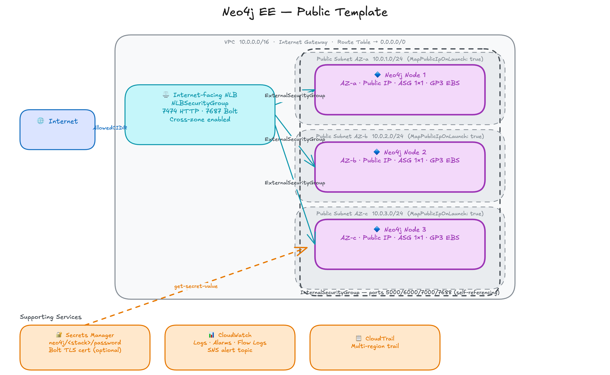

# Neo4j EE: Public

`neo4j-public.template.yaml` deploys a Neo4j Enterprise cluster in public subnets with an internet-facing Network Load Balancer. Every instance has a public IP. There is no bastion and no SSM tunneling required. Use this topology for proof-of-concept deployments, demos, and evaluation. Production and regulated workloads should use the Private template.

## Contents

- [General Operator Guide](#general-operator-guide)
  - [Prerequisites](#prerequisites)
  - [Access](#access)
  - [Retrieve the Password](#retrieve-the-password)
  - [Observability Checks](#observability-checks)
- [Architecture](#architecture)
  - [Network Topology](#network-topology)
  - [AWS Resources Created](#aws-resources-created)
  - [Security Configuration](#security-configuration)
  - [NLB Routing](#nlb-routing)
  - [EBS Persistence](#ebs-persistence)
  - [Two-Layer Security Group Design](#two-layer-security-group-design)
- [Local Deployment and Testing](#local-deployment-and-testing)
  - [Build](#build)
  - [Deploy](#deploy)
  - [Functional and Cluster Tests](#functional-and-cluster-tests)
  - [Tear Down](#tear-down)

---

## General Operator Guide

### Prerequisites

**AWS tooling**

```bash
aws --version         # AWS CLI v2
```

**IAM permissions**

These are the minimum permissions the operator's local IAM principal (user or assumed role) needs to run the tools in this guide. Each permission corresponds to API calls made from the operator's machine. The cluster nodes use a separate IAM role scoped to what they need at boot.

| Permission | Resource | Used by |
|---|---|---|
| `cloudformation:DescribeStacks` | The stack ARN | `deploy.py` (reads stack outputs), observability and teardown scripts |
| `secretsmanager:GetSecretValue`, `secretsmanager:DescribeSecret` | `neo4j/<stack-name>/password` | Retrieving the Neo4j admin password |
| `ssm:SendCommand`, `ssm:GetCommandInvocation`, `ssm:DescribeInstanceInformation` | The cluster EC2 instances | `test-observability.sh` (checks CloudWatch agent via SSM Run Command) |

### Access

Connection details are in the stack outputs:

```bash
aws cloudformation describe-stacks \
  --stack-name <stack-name> \
  --region <region> \
  --query 'Stacks[0].Outputs' \
  --output table
```

This returns the NLB DNS name and Bolt URI. Connect directly from your machine. No SSM tunneling required.

- Neo4j Browser: `https://<AdvertisedDNS>:7473`
- Bolt: `neo4j+s://<AdvertisedDNS>:7687`

The NLB DNS resolves to the public IPs of the EC2 instances. Connections from outside `AllowedCIDR` are dropped at the NLB security group.

### Retrieve the Password

The Neo4j admin password is stored in Secrets Manager at `neo4j/<stack-name>/password` as a plain string: the password value itself, not JSON. The secret ARN is in the stack outputs as `Neo4jPasswordSecretArn`.

```bash
aws secretsmanager get-secret-value \
  --secret-id <password-secret-arn> \
  --query SecretString --output text

# Or use the ready-to-run command from the stack outputs:
aws cloudformation describe-stacks \
  --stack-name <stack-name> --region <region> \
  --query 'Stacks[0].Outputs[?OutputKey==`Neo4jPasswordRetrieveCommand`].OutputValue' \
  --output text | bash
```

### Observability Checks

Verify CloudWatch agent, application logs, VPC flow logs, failed-auth alarm, and CloudTrail:

```bash
./test-observability.sh                  # most recent deployment
./test-observability.sh <stack-name>     # specific deployment
./test-observability.sh --step <name>    # single step
```

| Step | What it checks | Typical duration |
|---|---|---|
| `cloudwatch` | CloudWatch agent active on all nodes (via SSM Run Command) | <1 min |
| `logs` | Application log group exists with the expected stream count | <1 min |
| `flowlogs` | VPC flow log group exists and has ENI streams | <1 min |
| `alarm` | Failed-auth alarm transitions to ALARM after 12 bad login attempts | ~7 min |
| `cloudtrail` | A multi-region CloudTrail trail exists and is logging | <1 min |

---

## Architecture



### Network Topology

Three-node cluster:
- VPC with three public subnets, one per AZ
- Internet-facing NLB distributing traffic across all three subnets
- Three EC2 instances with public IPs, no NAT Gateways, no private subnets
- Internal security group restricting cluster ports (5000, 6000, 7000, 7688) to cluster members only

Single-instance:
- VPC with one public subnet
- Internet-facing NLB in that subnet
- One EC2 instance with a public IP

### AWS Resources Created

| AWS Resource | What it creates |
|---|---|
| VPC | New VPC with public subnets: one per AZ for a 3-node cluster, one for a single instance |
| Internet Gateway | Outbound internet access; no NAT Gateways needed |
| Internet-facing NLB | Listeners on port 7473 (HTTPS) and 7687 (Bolt); distributes connections across cluster nodes |
| EC2 instances | 1 or 3 Neo4j nodes with public IPs; no NAT, no private subnets |
| ASG per node | One Auto Scaling Group per Neo4j node, fixed at `MinSize=MaxSize=DesiredCapacity=1`, for self-healing |
| EBS data volumes | One GP3 volume per node with `DeletionPolicy: Retain`; survives stack deletion |
| Security groups | `NLBSecurityGroup` (AllowedCIDR on 7473/7687 to the NLB); `ExternalSecurityGroup` (NLBSecurityGroup as source on 7473/7687 to the instances); `InternalSecurityGroup` (cluster ports 5000/6000/7000/7688 between cluster members only) |
| Secrets Manager | Neo4j admin password at `neo4j/<stack>/password` |
| CloudWatch | Log group, VPC flow logs, failed-auth alarm, CloudTrail trail |

### Security Configuration

| Setting | Value | Notes |
|---|---|---|
| `AllowedCIDR` | Required | CIDR allowed to reach ports 7473 and 7687. `0.0.0.0/0` is rejected. `deploy.py` defaults to `<your-public-ip>/32`. |
| NLB security group | Filters external traffic | `AllowedCIDR` on ports 7473 and 7687 to the NLB |
| Instance security group | Sources from NLB SG | Allows both forwarded client traffic and NLB health checks without hardcoding a VPC CIDR |
| IMDSv2 | Enforced | Instance metadata requires session tokens; IMDSv1 requests are rejected |
| JDWP (port 5005) | Disabled | Remote debug port is closed and the JVM debug flag is stripped from `neo4j.conf` at boot |
| TLS | Required | `CertificateArn` is an ACM certificate ARN whose SAN matches `AdvertisedDNS`. The NLB presents it on 7473 and 7687, then re-encrypts to self-signed backend certs on each instance. |

### NLB Routing

At boot, each cluster node sets two `neo4j.conf` values:

```
server.bolt.advertised_address = <AdvertisedDNS>:7687
server.https.advertised_address = <AdvertisedDNS>:7473
dbms.routing.default_router    = SERVER
```

Setting the advertised address to `AdvertisedDNS` means every routing table entry points back to the NLB through a DNS name that matches the ACM certificate. A driver connecting with `neo4j+s://` receives a routing table containing only `AdvertisedDNS`, sends all subsequent requests through the NLB, and lets Neo4j server-side routing handle write-versus-read direction.

| Access pattern | URI | Notes |
|---|---|---|
| Direct from internet | `neo4j+s://<AdvertisedDNS>:7687` | ACM cert validates against AdvertisedDNS; Route 53 must point AdvertisedDNS at the NLB. |
| Direct node IP (same subnet) | `neo4j+ssc://<node-ip>:7687` | Bypasses NLB; single node, no failover. `+ssc` skips cert validation since the self-signed backend cert is not bound to an IP. |

### EBS Persistence

Each node has a dedicated GP3 EBS data volume. `DeletionPolicy: Retain` keeps the volume when the stack is deleted or the ASG replaces an instance. On each new instance launch, UserData resolves the correct NVMe device by matching the EBS volume serial number against `/dev/disk/by-id/nvme-Amazon_Elastic_Block_Store_*` and mounts the volume without reformatting.

### Two-Layer Security Group Design

NLB health checks originate from the NLB's private VPC IPs, not from `AllowedCIDR`. If `AllowedCIDR` is applied directly to the instance security group, health check traffic is blocked and all NLB targets fail.

The template solves this with two security groups:
- `Neo4jNLBSecurityGroup` on the NLB: allows `AllowedCIDR` on 7473/7687. Filters external client traffic without hardcoding any VPC CIDR.
- `Neo4jExternalSecurityGroup` on the instances: sources from `Neo4jNLBSecurityGroup` via `SourceSecurityGroupId`. Allows both forwarded client traffic and NLB health checks.

This pattern works for any marketplace deployment without knowing the VPC CIDR at template-authoring time.

---

## Local Deployment and Testing

### Build

Regenerate the output template after editing any file in `templates/src/`:

```bash
cd neo4j-ee/templates
python build.py
```

Commit both the edited partial and the regenerated `neo4j-public.template.yaml`.

### Deploy

```bash
cd neo4j-ee

# 3-node cluster, t3.medium, random region
./deploy.py --mode Public --cert-arn <arn> --advertised-dns <dns>

# Single instance
./deploy.py --mode Public --number-of-servers 1 --cert-arn <arn> --advertised-dns <dns>

# Memory-optimized instance
./deploy.py --mode Public r8i.xlarge --cert-arn <arn> --advertised-dns <dns>

# Pin region (avoids 10-20 min AMI copy)
./deploy.py --mode Public --region us-east-1 --cert-arn <arn> --advertised-dns <dns>

# Use the published Marketplace AMI
./deploy.py --mode Public --marketplace --cert-arn <arn> --advertised-dns <dns>

# Enable CloudWatch alarm email notifications
./deploy.py --mode Public --alert-email you@example.com --cert-arn <arn> --advertised-dns <dns>
```

`deploy.py` detects your public IP automatically and restricts the security group to `<your-ip>/32`. Pass `--allowed-cidr` to override. The script writes outputs to `.deploy/<stack-name>.txt`.

Stack creation takes 5-10 minutes.

> **Note:** The test runner (`uv run test-neo4j --edition ee`) must execute from the same egress IP used at deploy time, or the security group blocks Bolt and HTTP connections. For CI, pass `--allowed-cidr` with a static egress IP at deploy time.

### Functional and Cluster Tests

Run the full test suite against a deployed stack:

```bash
cd ../test_neo4j
uv run test-neo4j --edition ee                     # most recent stack
uv run test-neo4j --edition ee --stack <name>      # specific stack
```

The suite covers connectivity, cluster topology, NLB scheme, volume configuration, security group rules, IMDSv2 enforcement, JDWP absence, and EBS resilience. All 29 functional checks pass on a healthy 3-node public stack.

### Tear Down

```bash
./teardown.sh <stack-name>
./teardown.sh --delete-volumes <stack-name>   # also permanently deletes EBS volumes
```
